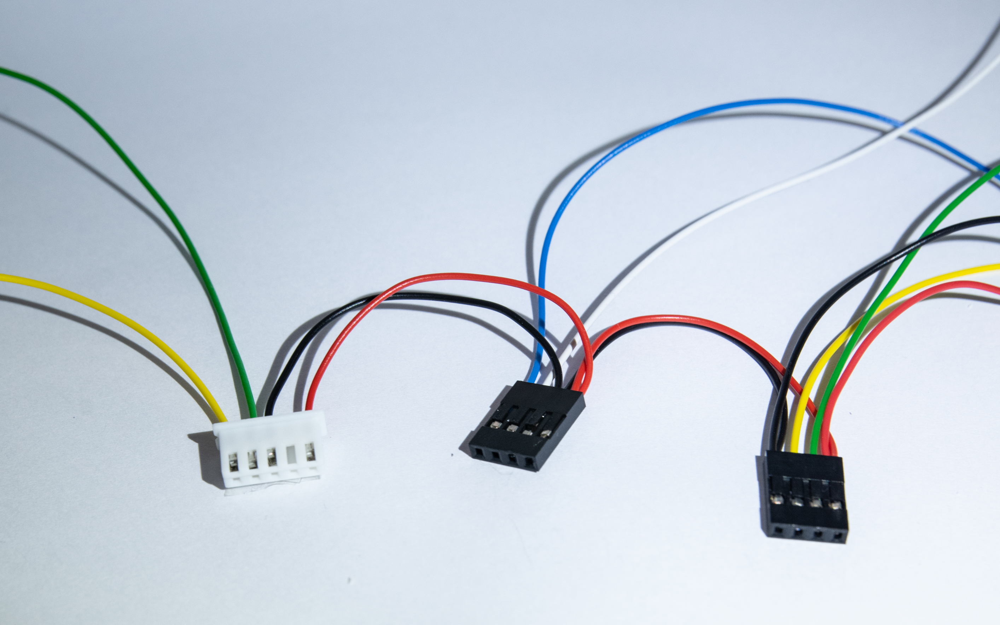
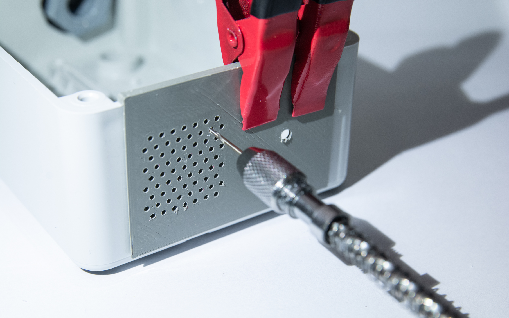
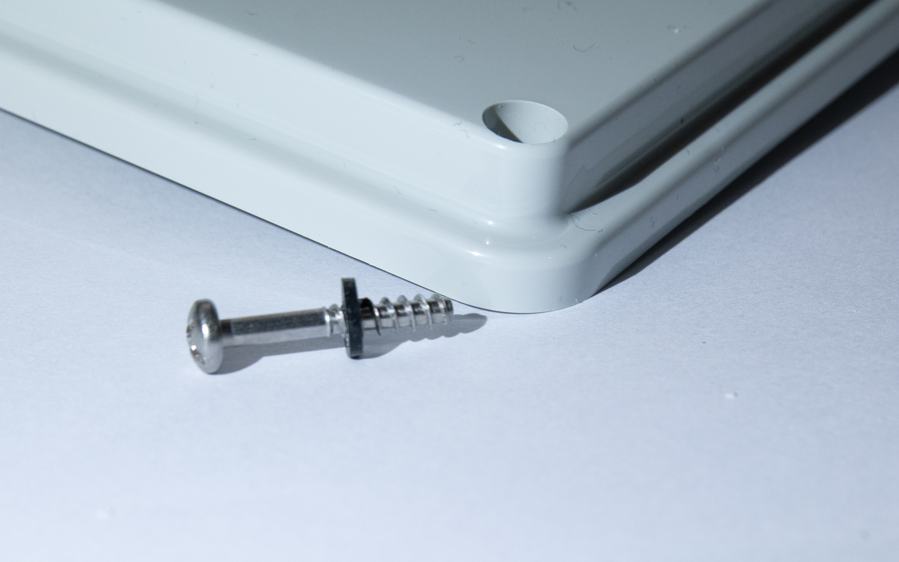
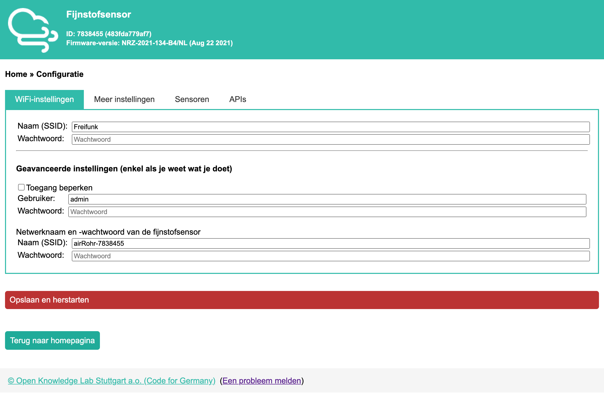

# Instructions

* [Introduction](#introduction)
* [Printing the parts](#printing-the-parts)
* [Assembly](#assembly)
  + [Creating the cable loom](#creating-the-cable-loom)
  + [Drilling the enclosure holes](#drilling-the-enclosure-holes)
  + [Installing the enclosure bracket](#installing-the-enclosure-bracket)
  + [Installing the cable glands](#installing-the-cable-glands)
  + [Installing the electronics](#installing-the-electronics)
  + [Hooking it up](#hooking-it-up)
    - [Flexible tube length](#flexible-tube-length)
  + [Finishing steps](#finishing-steps)
* [Flashing the firmware](#flashing-the-firmware)
* [Configuration](#configuration)
  + [Advanced configuration](#advanced-configuration)
* [Registration](#registration)
* [Home Assistant integration](#home-assistant-integration)
  + [Local Luftdaten](#local-luftdaten)
* [Mounting instructions](#mounting-instructions)
* [Troubleshooting](#troubleshooting)

## Introduction
The steps in these introductions are all the steps I needed to create a single
enclosure. Feel free to adapt, replace or skip any of the steps, to make your
own version.

Some of the photos in this guide are from a prototype version. They might not
look similar, but they are correct.

## Printing the parts
You can find the printable files in the [3d](3d/) folder. The parts do not
require special attention. Make sure that you print the parts with the biggest
flat surface down. At least 20% infill will ensure they are rigid enough. I
used PLA, but since the sensor must not be installed in direct sunlight, I do
not expect any problems.

It depends on the use-case if you need all the parts.

You need at least:

* Enclosure bracket
* PCB bracket
* Screw hole covers

For usage with a flexible tube:

* Tube bracket
* Tube fixing ring (2x)

For easy drilling of the enclosure:

* Drill templates (top and bottom)
* Rubber seal templates (16 mm and/or 12 mm)

## Assembly

### Creating the cable loom

For this step, you will need:

* 4-pin 2.54 mm male header
* 4-pin 2.54 mm male header right angled
* 4-pin 2.54 mm female Dupont headers (2x) with terminal pins (8x)
* JST terminal pins (4x)
* Wires (thin, six colors if possible)
* Pliers, crimping tools and wire strippers

The sensors can be soldered to the ESP8266, but another option is to create a
cable loom and use wire-to-board connectors.

The cable should be assembled as follows (do not solder it to the ESP8266 yet):

[](images/Wiring.jpg)
[](images/Wiring%20Overview.svg)

You can re-use the JST connector housing that comes with the SDS011 cable.

### Drilling the enclosure holes
For this step, you will need:

* enclosure (Gewiss GW44 205)
* A slow (hand-operated) drill with a 1 - 1.2 mm drill bit
* An electric drill with a 3 mm drill bit
* A 16 mm spade drill bit
* Small piece of scrap wood
* Strong adhesive tape
* Sharp chisel or another deburring tool

The drilling step is a time-consuming step.

Secure the drill templates on the top and bottom side of the enclosure, using
some strong adhesive tape. The templates should be centered and tightly mounted
to the edge of the enclosure.

The small holes should be drilled carefully. Use a hand-operated drill, because
an electric drill will melt the plastic, clogging up the drill and potentially
breaking the drill itself.

[](images/Hand%20Drill.jpg)
[](images/Drilling.jpg)

The bigger holes should be pre-drilled using a 3 mm drill bit first. Use a
piece of scrap wood on the back side, so that the drill bit does not shoot
through the plastic, potentially damaging the enclosure.

On the bottom side (next to the outtake holes), use the 16 mm spade drill bit
to create a hole for the cable gland for the power supply. On the top side, use
a 16 mm spade drill bit for the flexible tube as well. Use the piece of scrap
wood on the back side of the plastic.

**Note:** make sure that you hold the enclosure firmly during drilling. If the
spade drill bit gets stuck, it might start to rotate the enclosure.

**Note:** if you plan to directly solder the power supply cable, you can better
drill a 12 mm hole on the bottom side.

Clean-up all the holes and remove any of the burrs. This ensures that the
rubber seals can be mounted properly. A chisel works great in this case,
without scratching the plastic.

### Installing the enclosure bracket
For this step, you will need:

* Enclosure bracket
* M3 Brass inserts (5.3 mm outer diameter, 6 mm tall)
* M3 8 mm self-tapping button-head screws (4x)
* An electric drill with a 3 - 4 mm drill bit
* Small piece of scrap wood
* Soldering iron

Drill the enclosure mounting holes first, depending on your desires. If you
decide to hang it on two scows, make sure that you drill the two top holes
only. Use the scrap piece of wood to ensure that the drill bit does not shoot
through the case.

Insert the M3 brass inserts in the three bigger stand-offs on the enclosure
bracket. The easiest is to do this with a soldering iron. Make sure that the
molten plastic does not get inside the brass insert. One way to do so, is to
insert a small M3 bolt first (e.g. 6 mm bolt).

[](images/Brass%20Inserts.jpg)

Mount the enclosure bracket next. Use the four M3 self-tapping screws to secure
it to the enclosure.

### Installing the cable glands
For this step, you will need:

* Cable gland 16 mm (2x) including nut (2x)
* Rubber seal 16 mm (2x)

**Note:** you can also cut some seals from an old bicycle tire, using the
rubber steal template.

Install the cable glands on the top and bottom side. From the inside, put on
the rubber seal first and then the nut. Tighten the nut by hand, ensuring that
it is as tight as possible. Verify that it will not come loose when you tighten
the cable gland itself.

The rubber seal ensures that the cable gland does not get loose and prevents
water from coming in.

[](images/Cable%20Gland%20Seal.jpg)
[](images/Cable%20Gland%20Nut.jpg)

If you decide to mount the enclosure, now is the time to mount it to its final
destination. The enclosure mounting screws will be hard to reach once you
finish the next step. To improve water resistance, use a M3 or M4 seal on the
inside between the screw and the enclosure.

### Installing the electronics
For this step, you will need:

* M3 15 mm brass stand-offs with 6 mm thread (3x)
* M3 spacer 3 mm (3x)
* M3 10 mm bolt
* ESP8266 (Wemos D1 Mini V3)
* Air quality sensor (SDS011)
* GPS sensor (NEO 6M with the blue PCB and solderable antenna).
* Temperature and humidity sensor (BME-280, 5V version)
* PCB bracket
* M2 self-taping screws
* Wiring loom, or wires for soldering

Fix the GPS sensor and the ESP8266 on the PCB bracket.

Install the brass stand-offs in the brass inserts in the enclosure bracket.
Then place the air quality sensor on top, with the fan down. Then place the
PCB bracket on top, using 3 mm spacers. Fix them with the 10 mm bolts.

[](images/Brass%20Standoffs.jpg)

Then connect the wiring according to the diagram above. Use the following
pinout:

SDS011:

* Pin 1 (TX) -> Pin D1 (GPIO5)
* Pin 2 (RX) -> Pin D2 (GPIO4)
* Pin 3 (GND) -> GND
* Pin 4 (2.5m) -> unused
* Pin 5 (5V) -> 5V
* Pin 6 (1m) -> unused

BME-280 (5V version):

* Pin 1 (VCC) -> 5V
* Pin 2 (GND) -> GND
* Pin 3 (SCL) -> Pin D4 (GPIO2)
* Pin 4 (SDA) -> Pin D3 (GPIO0)

NEO-6m:

* Pin 1 (VCC) -> 5V
* Pin 2 (TX) -> Pin D5 (RX)
* Pin 3 (RX) -> Pin D6 (TX)
* Pin 4 (GND) -> GND

[](images/Inside%20Enclosure.jpg)

### Hooking it up
For this step, you will need:

* Tube fixing ring (2x)
* Tube bracket
* 15-20 cm flexible tube (6 mm inner diameter, 8 mm outer diameter)
* Power supply cable (e.g. USB cable)
* Zip tie

Insert the flexible tube through the cable gland and connect it to the intake
of the air sensor. Install a tube fixing ring on the inside. This ring should
prevent water (if any at all) from running down the tube into the sensor.
Then install the tube bracket on the cable gland and install the flexible tube
to the bracket, with a tube fixing ring on the end.

[](images/Tube%20Bracket.jpg)
[](images/Tube%20Bracket%Installed.jpg)

Install the power supply cable. The USB cable should fit thourgh the 16 mm
cable gland. Route it behind the PCB bracket and connect it to the ESP8266. Use
zip tie to fix it to the PCB bracket top hole, for additional stress
relief.

[](images/Stress%20Relief.jpg)

The cable gland on the bottom should be tightened all the way for the power
supply cable. This acts as an additional strain relief. The cable gland one on
top should be tightened as well, but not too tight. The flexible tube must not
be compressed too much otherwise it could obstruct the air flow. Make sure that
if you pull on the tube, it cannot move. Then look down the tube, to see if you
do not see any inward affliction of the tube.

#### Flexible tube length
The shorter the tube, the better it is. According to the datasheet of the
sensor, a tube length up to 1 m is allowed. The original manual suggests the
use of a 20 cm tube. The Dutch National Institute for Public Health and the
Environment, who are [stimulating] people to join the Sensor.Community,
suggests to use a tube less than 5 cm, to increase plausibility of
measurements.

For my design, a tube of approximately 15-20 cm is necessary to create an
unobstructed 180 degree bend. Without a tube, it would be hard to ensure that
the sensor is mounted upright AND make it water-resistant. It also ensures that
the sensor sucks up fresh air (away from the outtake).

The tube has a inner diameter of 6 mm (~28 mm² of area), the actual intake
port has a diameter of 5 mm (~19 mm² of area). The 60+ outtake holes (~68 mm²
of area) should allow for an unobstructed air flow. I have compared my sensor
with other nearby sensors, and it performs identical.

A more-scientific study observed a decrease in the maximum air flow of the
flexible tube, with longer tube lengths. Comparing 20 cm with 100 cm, the air
flow decreased linearly from 664 ml/min to 412 ml/min. Every 1 cm of tube would
impact the maximum air flow by about 0.5 %. Note that this is the maximum air
flow, which may be much higher than the air flow generated by the air quality
sensor. More details of this research can be found
[here](https://pudi.lubw.de/detailseite/-/publication/90536).

### Finishing steps
For this step, you will need:

* The screw hole covers (4x)
* M3 x 7 mm rubber seals (4x)

Last step is to install the lid. The enclosure comes with four screws to close
the lid. For additional water proofing, add a M3 rubber seal and finish it off
with a screw hole cover.

[](images/Weatherproofing.jpg)

The screw hole cover can be removed with a large flat head.

Your sensor is now ready for use.

## Flashing the firmware
For this step, you will need:

* A micro USB cable
* [esptool.py](https://github.com/espressif/esptool)
* Firmware file (see [firmware](firmware/) folder.

From the command line, invoke:

```
esptool.py --port [PORT] write_flash -fm dio 0x00000 latest_en.bin
```

Replace `[PORT]` with the serial port of your sensor. It is typically
`/dev/tty/tty.USBxyz` on Linux and `COMn` on Windows.

Once flashing is completed, power cycle the sensor.

## Configuration
Power-on the sensor. If it has not been configured before, it will start a
wireless network. Connect to this network, and navigate to http://192.168.4.1.

[](images/Configuration.png)

On the configuration page, you can configure the WiFi network to use. It is
also possible to configure the hardware and API connections. Some points of
attention:

* Make a note of the 7-digit identifier shown in the top bar. You will need
  this in the next step.
* Enable beta updates. Note that your sensor may seem unresponsive the next
  time it boots, because it will most likely download the new firmware.
* Enable the Sensor.Community API integration (using HTTPS). Enable others as
  desired. You do not need to enable any API integrations if you decide to use
  the local Home Assistant integration.
* Ensure that you enable the right hardware. For this build, enable
  * SDS011
  * BME280
  * GPS (NEO 6M)

If the sensor cannot find the configured wireless network, it will start its
own wireless network again. You can then start over.

### Advanced configuration
The ESP8266 is a power-hungry WiFi chip. This results in some heating-up of the
enclosure, depending on the exact module used and the amount of WiFi traffic.
This will affect the BME280 temperature and humidity readings.

It is possible to account for an offset of the temperature readings in the
firmware (this is not possible for humidity, unfortunately). To find the
offset, it is possible to run the sensor for some time, without the lid of the
enclosure mounted. The graphs below show the offsets for two of my sensors
(yellow line is the one without the lid mounted).

[](images/Calibration%20Temperature.png)
[](images/Calibration%20Humidity.png)

The graph show an offset of about 2 °C, and it follows the temperature curve of
the sensor with the enclosure without the lid. Similar results were achieved in
different environments.

Note that when the lid is not mounted, the sensor is directly exposed to wind.
These results might be less accurate as well, since a proper temperature sensor
should be mounted out of the wind. Therefore, the actual offset is probably
somewhere between 1 °C and 2 °C.

Drilling bigger outtake holes and installing a fan shroud (e.g. from paper) are
ways to reduce the effects of self-heating.

## Registration
If you decide to contribute to Sensor.Community, you can go to
https://devices.sensor.community/ to create an account.

Once you have created an account, you can add sensors using the sensor
identifier from the previous step. An important note here is that you cannot
modify an existing sensor, and if you delete it, you cannot register it again.
Make sure that you add three sensors under the 'Hardware Configuration'
section:

* SDS011
* BME280
* GPS-NEO-6M

Once your sensor is registered, you can look it up at
https://maps.sensor.community/. It might take some time before the first
measurements appear.

If you made any mistakes during the registration, please check
[this](https://forum.sensor.community/t/reregister-unregister-sensor/494) for
details on how to get support (you will need to send an email and ask them to
manually correct the registration).

## Home Assistant integration
There are two sensor for Home Assistant available. The first one uses the
Sensor.Community API, the other directly talks with the sensor.

* https://www.home-assistant.io/integrations/luftdaten/
* https://github.com/lichtteil/local_luftdaten

### Local Luftdaten
After installing the integration per installation instructions, add the
configuration below to your `configuration.yaml`. Aadapt the IP address to
match your sensor's IP address. The scan interval should not be less than 120
seconds, because the sensor itself does not update faster than that.

```yaml
sensor:
  - platform: local_luftdaten
    host: [IP HERE]
    scan_interval: 120
    name: Air Quality Sensor
    monitored_conditions:
      - BME280_humidity
      - BME280_pressure
      - BME280_temperature
      - SDS_P1
      - SDS_P2
```

Restart Home Assistant, and you should have additional sensors to add to your
dashboard.

## Mounting instructions
There are some mounting instructions:

* Mount the sensor upright (tube on top). The sensor requires this position, so
  that gravity optimizes the flow of particles through the air sensor. It also
  ensures that water cannot enter the outtake holes on the bottom.
* Make sure that splashing water cannot enter the outtake holes on the bottom.
* The sensor should be mounted in the outside and average environment. This
  means that you should not place it next to a chimney, for example.
* Ideally, the sensor should be mounted at 1.5 m height. During the
  registration of the sensor, you can account for other heights.
* Do not mount the sensor in direct sunlight. The temperature sensor might
  report incorrect measurements.

Finally:

* Inspect the sensor once or twice per year. Check if it is still mounted
  securely, that there is no dirt inside the sensor and the tube is clean.
* Discoloration due to UV light is to be expected.

## Troubleshooting
Some things to consider when troubleshooting a sensor:

* If you plug in the power, you should hear the fan spin up for a brief
  period. If it does not turn on, check the connections. If it does not turn
  off, something might be wrong with the firmware.
* Check the web interface for debug logging and error counters.
* Some ESP8266 boards have on-board USB-to-serial. The firmware will output
  logging to this port (at 9600 baud).

[stimulating]: https://www.samenmetenaanluchtkwaliteit.nl/data/plausibiliteit-van-fijnstofmeting
